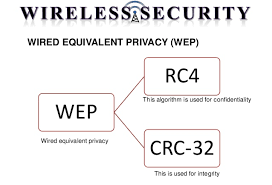

# JARINGAN NIRKABEL

## KEAMANAN JARINGAN NIRKABEL

### WEP (Wired Equivalent Privacy)
  WEP adalah suatu metode pengamanan jaringan nirkabel, merupakan standar keamanan & enkripsi pertama yang digunakan pada wirelessEnkripsi WEP menggunakan kunci yang dimasukkan (oleh administrator) ke klien maupun access point. Kunci ini harus cocok dari yang diberikan akses point ke client, dengan yang dimasukkan client untuk authentikasi menuju access point, dan WEP mempunyai standar 802.11b.
Alasan Memilih WEP - WEP merupakan sistem keamanan yang lemah. Namun WEP dipilih karena telah memenuhi standar dari 802.11 yakni :
    Exportable
    Reasonably strong
    Self-Synchronizing
    Computationally Efficient
    Optional.
    
Fungsi WEP - WEPini dapat digunakan untuk verifikasi identitas pada authenticating station. WEP dapat digunakan untuk data encryption.

### Service Set Identitas (SSID)
  Memungkinkan suatu jaringan WLAN dipisahkan dalam beberapa network yang
berbeda. Pengenal ini diprogram dalam access point, sehingga semua klien yang akan mengakses jaringan ini harus dikonfigurasi menggunakan pengenal SSID yang sesuai.

